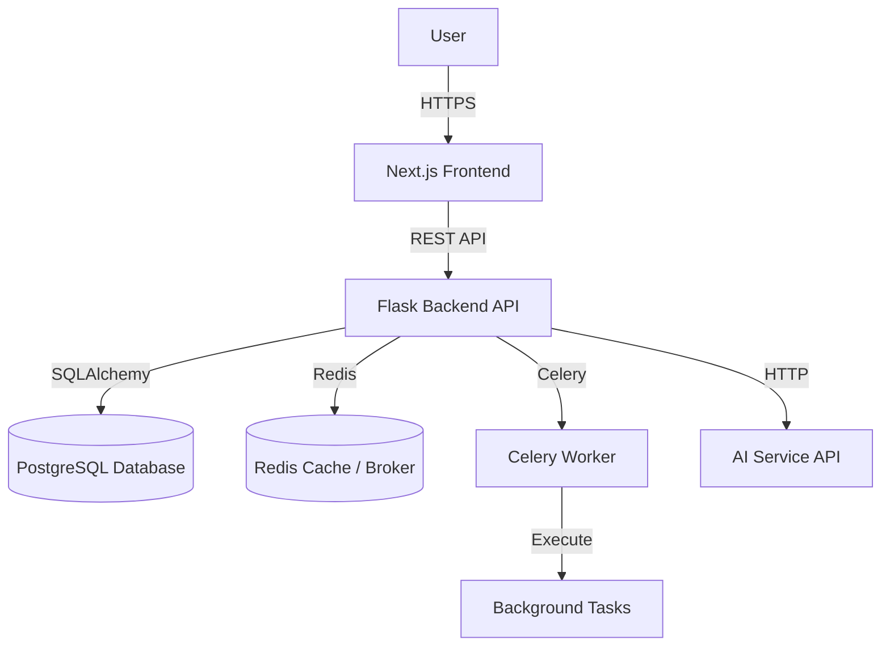

# System Architecture

This document provides a comprehensive overview of the **Backend Generator Platform** architecture. The system is designed as a modern, decoupled web application consisting of a Next.js frontend and a Flask backend.

## 🏗️ High-Level Architecture

The application follows a standard **Client-Server** architecture with the following components:



## 📂 Directory Structure

### Root
- `backend/`: Python Flask API application
- `frontend/`: Next.js React application
- `README.md`, `SETUP_GUIDE.md`, `QUICK_START.md`: Documentation
- `setup.bat`: Automated setup script

### Backend (`/backend`)
The backend is structured using a **Service-Repository** pattern (implemented via SQLAlchemy models) to separate concerns.

```
backend/
├── app/
│   ├── models/       # Database models (SQLAlchemy)
│   ├── routes/       # API endpoints (Flask Blueprints)
│   ├── services/     # Business logic & complex operations
│   ├── utils/        # Helper functions & validators
│   └── __init__.py   # App factory & configuration
├── config/           # Environment-specific config
├── tests/            # Pytest test suite
├── run.py            # Entry point
└── requirements.txt  # Python dependencies
```

**Key Components:**
- **Routes**: Handle HTTP requests, input validation (Pydantic), and authentication context. They delegate logic to Services.
- **Services**: Contain the core business logic (e.g., `ProjectService`, `AIService`, `GeneratorService`). They interact with Models.
- **Models**: Define the database schema and relationships.

### Frontend (`/frontend`)
The frontend is built with **Next.js 14+ (App Router)** and follows a component-based architecture.

```
frontend/
├── app/              # App Router (Pages & Layouts)
│   ├── (auth)/       # Auth group (Login/Signup)
│   ├── dashboard/    # Protected Dashboard area
│   ├── wizard/       # Project creation wizard
│   ├── api/          # Next.js API Routes (Proxy)
│   ├── layout.tsx    # Root layout
│   └── page.tsx      # Landing page
├── components/       # React Components
│   ├── ui/           # Reusable UI primitives (shadcn/ui)
│   ├── wizard/       # Wizard-specific step components
│   ├── dashboard/    # Dashboard widgets
│   └── ...           # Shared components (Header, Sidebar)
├── hooks/            # Custom React Hooks
├── lib/              # Utilities & API clients
└── public/           # Static assets
```

## 🔄 Data Flow Examples

### 1. User Authentication
1. User submits credentials on `/app/login`.
2. Frontend sends `POST /api/auth/login`.
3. Backend validates credentials, generates a **JWT**, and returns it.
4. Frontend stores JWT (e.g., in localStorage/cookies) and attaches it to `Authorization` header for subsequent requests.

### 2. Project Creation (The Wizard)
The central feature of the platform is the Project Generator Wizard.

1. **Step 1-5**: User inputs data in frontend Wizard components. State is managed locally (e.g., `useWizardState` hook).
2. **Submission**: On the final step, Frontend sends a composite payload to `POST /api/projects`.
3. **Processing**:
   - `ProjectService` creates the `Project` record.
   - `FeatureService` creates associated features (Auth, Database, etc.).
   - `GeneratorService` is triggered to scaffold the code structure.
4. **Generation**:
   - The system generates a file structure (folders, `.py` files, `requirements.txt`).
   - If AI attributes are requested, `AIService` calls the external LLM to generate code snippets.
5. **Download**: The user requests `GET /api/projects/{id}/download`. Backend zips the generated directory and streams the file.

## 🛠️ Technology Choices & Rationale

- **Flask**: Chosen for its flexibility and strong ecosystem for data processing and AI integration.
- **SQLAlchemy**: Provides a robust ORM for managing complex relationships between Users, Projects, and Features.
- **Next.js**: Offers SEO benefits (SSR) and a modern routing experience (App Router), plus easy integration with React ecosystem.
- **Tailwind CSS**: Enables rapid UI development with a consistent design system.
- **Celery + Redis**: Essential for handling long-running tasks like "AI Code Generation" or "Project Zipping" without blocking the HTTP request thread.

## 🔒 Security Architecture

- **RBAC**: Role-Based Access Control ensures users can only access their own projects.
- **Sandboxing**: Generated code execution (if applicable) is isolated to prevent host system compromise.
- **Input Validation**: All API inputs are strictly validated using Pydantic schemas.
- **Secret Management**: Sensitive keys (DB credentials, API keys) are managed via `.env` files and never committed to version control.
